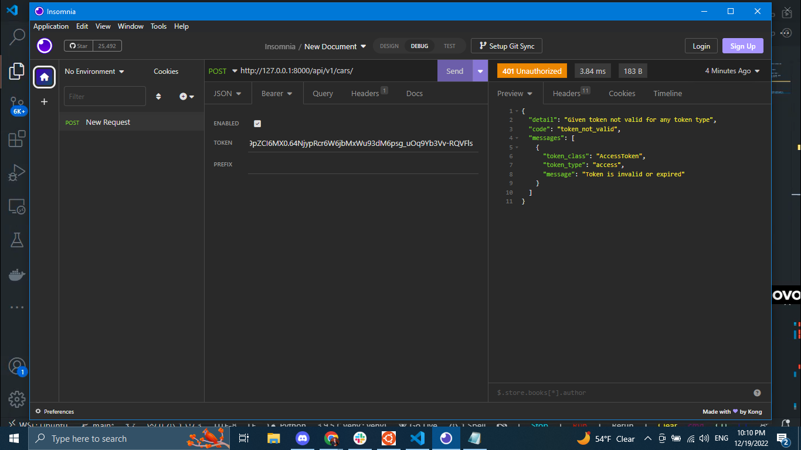
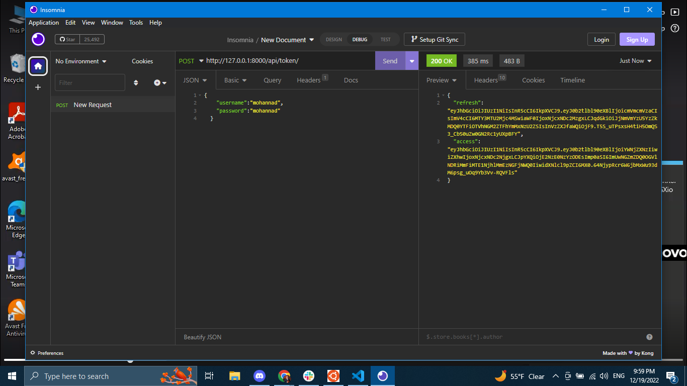
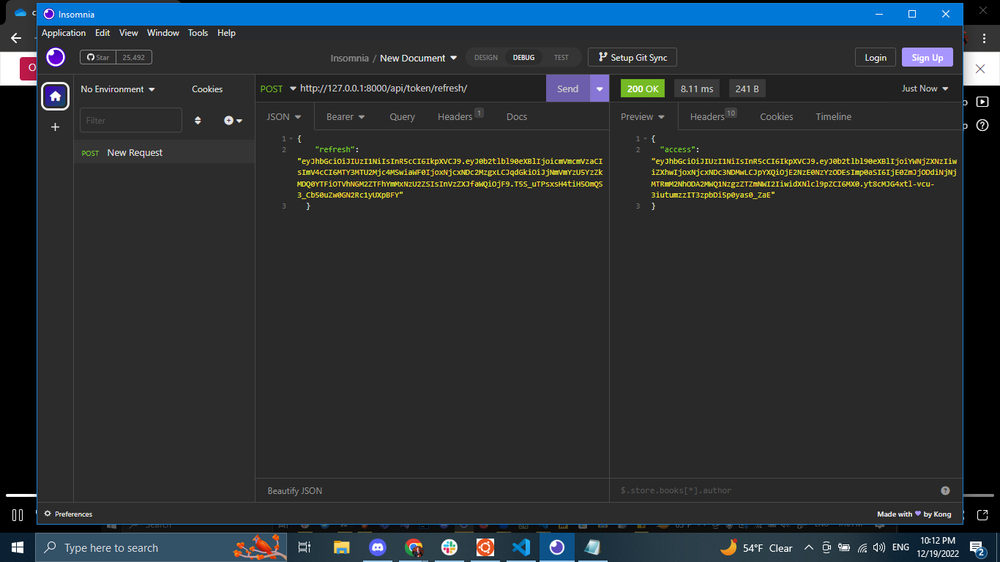
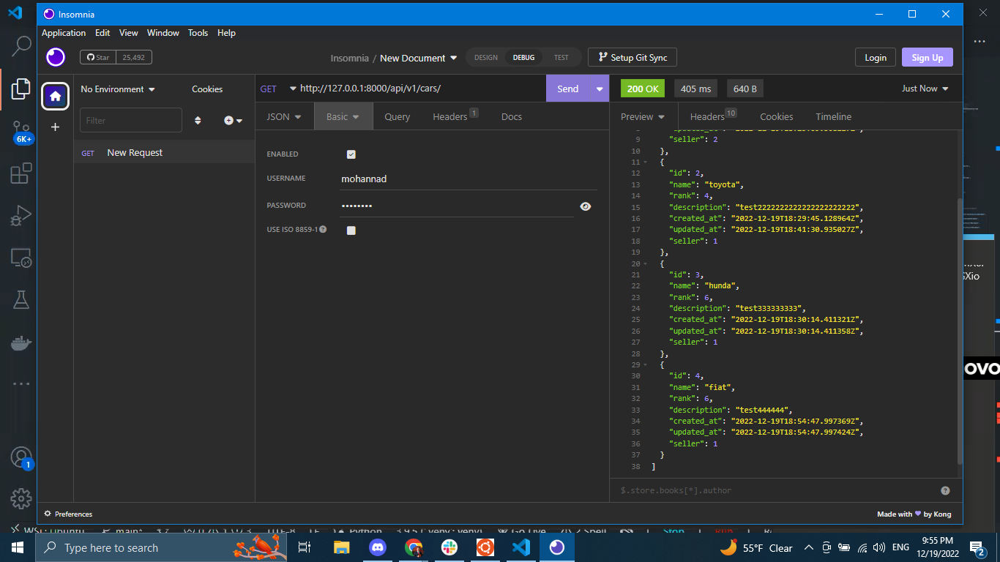

# drf-auth

## Author:Mohannad Ghbashneh

## Login

- **Docker Super User:** admin22
- **Password:** admin22


## Getting Started

1. Expired Token Response




2. Getting the Access and the Refresh Tokens



3. Get a new Access Token Using the Refresh Token



4. GET request to fetch all the data



 

 ## Installing the requirements

```
pip install -r requirements.txt
```

## Running the server

```
docker-compose up
```

#### Pull Requests
- [PULL REQUEST LINK](https://github.com/Mohannadghbashneh/drf-auth/pull/1)
